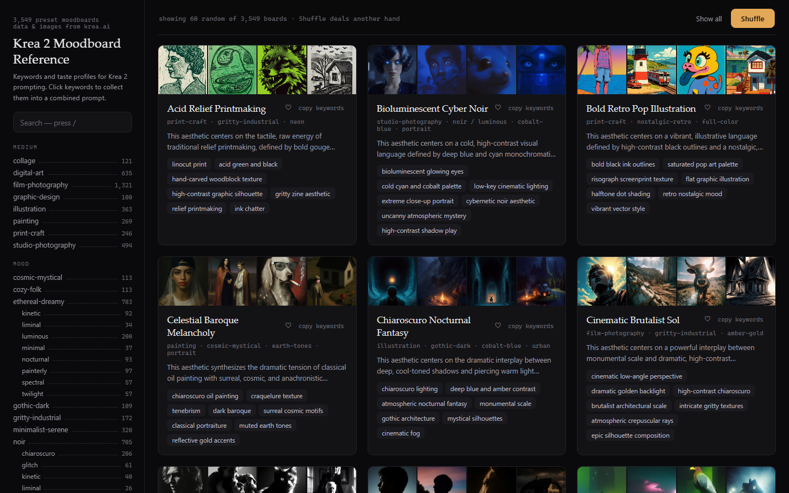

# Krea 2 Moodboard Reference

A browsable, searchable catalog of all **3,549 Krea preset moodboards** — the styles behind
[Krea 2](https://www.krea.ai)'s moodboard feature — with each board's keywords, curator
"taste profile", preview images, and a four-facet style classification. Built as a prompting
reference: the keyword vocabulary is Krea's own curation, i.e. in-distribution language the
model demonstrably responds to.

**Browse it live: <https://altinfire.github.io/krea2-moodboard/>**
— or clone the repo and open `index.html` directly (fully offline, works via `file://`,
no server needed).



## Using it

- The page opens on **60 random boards** — Shuffle deals a new hand (respecting active
  filters), Show all expands to everything.
- **The index rail** (left) keeps the whole facet vocabulary visible: click an entry to
  filter by medium / mood / palette / subject (click again to clear), with per-value counts
  throughout. Under the two biggest moods (noir, ethereal-dreamy), indented **registers**
  subdivide further — chiaroscuro, nocturnal, spectral, glitch, kinetic... — see
  [`taxonomy-mood.md`](taxonomy-mood.md). On narrow windows the rail collapses to chip rows.
- **Search** (`/` focuses it) matches title, keywords, and taste profile.
- **Click keyword pills** to collect them into a floating prompt tray — mix keywords across
  boards, then Copy the combined comma-separated list into your prompt. **copy keywords**
  copies a single board's full set.
- **Click a thumbnail** for a lightbox (arrow keys navigate, Esc closes). **Click a facet
  label** on a card to filter by it. **Click the heart** to favorite; the favorites row in
  the rail narrows to your saved boards. Favorites and the tray persist in localStorage.
- Boards labeled **style-only (any subject)** are pure styles: Krea demos them on a fixed
  four-subject template (a person, a landscape, an animal, a house), so they'll take
  whatever subject you bring.

## Data source — the API that "didn't exist"

Everything comes from one **public, unauthenticated REST endpoint**:

```
GET https://www.krea.ai/api/preset-moodboards?limit=96&seed=42&cursor=<offset>
```

- `limit` max **96** (validation error above that), `cursor` is a plain offset echoed back
  as `nextCursor`, `seed` fixes the shuffle order so pages are disjoint.
- Each item: `id` (UUID), `name`, `styleKeywords[]` (6-8), `styleDescription` (the taste
  profile, ~450 chars), `isStaffPick`, `previewImages[]` (exactly 4: id/url/width/height),
  `images[]` (all ~12-16), timestamps. `total` gives the catalog size.
- The full crawl is ~37 requests / under a minute.

Historical note: two earlier scraping attempts assumed the gallery had *no* API ("gRPC only,
URLs discoverable only by clicking cards") and built elaborate browser-automation plans
around a virtualized React DOM. That premise was false — the endpoint above was found by
instrumenting `window.fetch` on the gallery page and simply looking at what it called.
**Check for a plain data endpoint before automating a browser.**

### Image CDN

Preview images are served resized by a public CDN. URL pattern (no auth):

```
https://optim-images.krea.ai/{source-url with '://'->'---' and [./]->'-'}-{SIZE}.webp
e.g. https://gen.krea.ai/images/<uuid>.png
  -> https://optim-images.krea.ai/https---gen-krea-ai-images-<uuid>-png-512.webp
```

Sizes 32 / 128 / 256 / 512 / 1024 all exist (~0.2 / 0.7 / 2 / 18 / 27 KB avg). The catalog
bundles the **512px** previews (~253 MB of data, ~297 MB on disk across 14K small files)
rather than hotlinking the CDN, so visitors never
hit Krea's bandwidth and the page keeps working if CDN URL patterns change. A couple of
images 404 at one size but exist at another — the build falls back manually to 1024 when
that happens (2 boards affected as of 2026-07).

## Files

| File | What it is |
|------|------------|
| `index.html` | The browsable reference. Self-contained: data inlined as JSON, no external deps. Regenerated by the build script — **do not hand-edit**. |
| `krea2-moodboards.json` | Catalog: slug, title, keywords, profile, facets (incl. `moodDetail`), image paths. Regenerated — do not hand-edit. |
| `krea2-moodboard-facets.json` | Pass-1 facet labels per slug **with provenance** (`source`: `consensus` / `arbiter`). This is the file the pass-1 classification pipeline owns; the build script merges it into the catalog by slug. |
| `krea2-moodboard-mood-registers.json` | Pass-2 mood registers for the noir / ethereal-dreamy buckets (`mood`, `moodDetail`, provenance, `prevMood` on the 80 corrected boards). Owned by the pass-2 classifier; the build script left-joins it over the pass-1 facets. |
| `build-moodboard-catalog.ps1` | The whole pipeline: crawl → JSON → images → HTML. |
| `classify-new-boards.ps1` | Facet-classifies boards missing from the facets file (dual Haiku vote + Sonnet arbiter via headless `claude -p`), appending after every batch, then rebuilds catalog + HTML. |
| `classify-mood-registers.ps1` | Pass-2 register classifier (same dual-vote + arbiter method, usage-gated between batches, resumable — re-runs skip classified slugs). |
| `taxonomy-mood.md` | Mood register vocabulary: derivation method, support gates, dropped candidates. |
| `adr-001-index-redesign.md` | Why the index-rail design was adopted (and what was considered). |
| `backlog.md` | Pre-announce polish items. |
| `moodboard-images/{slug}/01-04.webp` | 4 preview thumbnails per board, 512px webp. |

## Rebuilding / updating the catalog

Requirements: PowerShell 7+; the [Claude Code](https://claude.com/claude-code) CLI
(logged in) for the classification step only.

```powershell
# the standard update runbook — after these two commands, new boards are crawled,
# downloaded, facet-classified, and rendered:
./build-moodboard-catalog.ps1                  # crawl + images + html (new boards: facets null)
./classify-new-boards.ps1                      # classify unlabeled boards, then rebuild

# variants
./build-moodboard-catalog.ps1 -RawJson $env:TEMP\krea-moodboards-raw.json   # reuse a saved crawl
./build-moodboard-catalog.ps1 -SkipImages      # metadata + HTML only
./build-moodboard-catalog.ps1 -HtmlOnly        # regenerate HTML from existing catalog JSON
                                               #   (no crawl, no images — for template iteration)
./build-moodboard-catalog.ps1 -CleanImages     # needed if slug assignment changes (see below)
./build-moodboard-catalog.ps1 -Size 256
```

Behavior worth knowing:

- **Idempotent images**: existing non-empty files are skipped; orphan slug directories are
  pruned. ~14K downloads take a few minutes at ThrottleLimit 12.
- **Slugs** are kebab-cased names; duplicate names get `-2`, `-3`... suffixes assigned in
  `(createdAt, id)` order. If Krea inserts an *older* duplicate of an existing name, suffix
  assignment shifts — run with `-CleanImages` in that case so image dirs match slugs.
- **Facets survive re-crawls**: the script left-joins `krea2-moodboard-facets.json` by slug.
  New boards simply have `facets: null` (the HTML tolerates this) until classified.

## Facet classification

Every board carries one value per facet:

| Facet | Values |
|-------|--------|
| medium | film-photography, studio-photography, painting, illustration, print-craft, digital-art, collage, graphic-design |
| mood | noir, ethereal-dreamy, nostalgic-retro, surreal, minimalist-serene, gritty-industrial, gothic-dark, cozy-folk, vibrant-energetic, cosmic-mystical |
| moodDetail | *(noir + ethereal-dreamy only, nullable)* chiaroscuro, nocturnal, spectral, kinetic, luminous, minimal, glitch, liminal, twilight, painterly — see the pass-2 section below |
| palette | monochrome, cobalt-blue, crimson-red, amber-gold, teal-emerald, neon, pastel, earth-tones, full-color |
| subject | portrait, figure-motion, landscape, urban, nature-botanical, abstract, character-design, none |

The vocabulary was grounded in frequency analysis of the 11,290 unique keywords and title
words (687 titles contain "noir", 512 "ethereal" — these boards are style-first, so mood and
medium are the primary axes; ~52% are subject-agnostic).

**Why 53% of boards have subject `none` (verified — do not "fix"):** Krea demos style-only
presets on a fixed four-subject template: the 4 preview images are typically a person, a
landscape, an animal, and a house, each rendered in the board's style. A July 2026 vision
spot-check (30 random `none` boards, Haiku agents reading all 120 preview images) confirmed
28/30 as genuinely mixed-subject. `none` means "pure style, works with any subject" — the
HTML presents it as "style-only (any subject)", pinned last in the subject dropdown. Vision
reclassification would not reduce this share; the labels reflect reality.

### How the labels were produced (and how to classify new boards)

Pipeline (July 2026): **dual vote + arbiter**, all via structured output with the facet
values as JSON-schema enums (never freeform — calibration showed models invent values
otherwise):

1. Boards batched 50 per prompt as `slug | title | keywords | profile` lines.
2. **Two independent Haiku votes** per batch, identical prompts.
3. Facet-exact agreement → `source: consensus` (1,675 boards, 47%).
4. Any disagreement → **Sonnet arbiter** sees both votes + full context and decides all four
   facets → `source: arbiter` (1,874 boards, 53%).

A 60-board duplicate-classifier calibration shaped three tie-break rules that the final run
enforced (single-run agreement before sharpening: medium 93%, palette 87%, mood 82%,
subject 62%):

- **Mood**: if the *title* contains a mood word (nostalgic / ethereal / surreal / noir /
  gothic / celestial / cosmic / cozy / whimsical / minimalist / gritty / vibrant / kinetic...),
  that register wins; first such word wins if several. Titles are the curator's own signal.
- **Palette**: `monochrome` is strictly achromatic; a single hue + black/white belongs to
  that hue's family; accent colors never change the base palette.
- **Subject**: assign only when the title or a keyword *explicitly names* a depicted subject;
  otherwise `none`. (Without this rule, classifiers split ~40/60 on none-vs-inferred.)

To classify boards added by a future crawl, run `./classify-new-boards.ps1` — it automates
exactly this method via headless `claude -p` (two independent Haiku votes per batch of 50,
Sonnet arbiter on any disagreement, tie-break rules embedded in the prompt), appends to
`krea2-moodboard-facets.json` after **every** batch so an interrupted run loses at most one
batch (re-running skips already-classified slugs), and rebuilds catalog + HTML at the end.
Pipeline verified July 2026 against 6 held-out boards: 20/24 facet labels matched the
originals, consistent with the single-run agreement rates above. Approximate cost for the
full 3,549-board run: ~8.4M subagent tokens (mostly Haiku), a few dollars.

### Pass 2 — mood registers (`moodDetail`)

The two fat mood buckets (noir and ethereal-dreamy, ~43% of the catalog) barely narrowed
anything on their own, so a July 2026 second pass subdivided them with a **shared,
support-gated register vocabulary** derived from per-bucket frequency analysis — method,
evidence tables, and dropped candidates in [`taxonomy-mood.md`](taxonomy-mood.md). Each of
the 1,539 boards got a `moodDetail` register or `null` (`null` = plain member of the mood,
a normal outcome, ~9% of noir and ~15% of ethereal). Same dual-Haiku-vote + Sonnet-arbiter
pipeline (`classify-mood-registers.ps1`, 64% consensus), and pass 2 re-emitted the
top-level mood as an accuracy check: **80 boards moved** (noir 721→705, ethereal-dreamy
818→783, with gains for minimalist-serene, gritty-industrial, surreal and others). Records
live in `krea2-moodboard-mood-registers.json` with the same provenance model plus
`prevMood` on corrections; the build script overrides `facets.mood` and adds
`facets.moodDetail` from it, and the index rail renders registers indented under their
parent mood. Extending the pass to `surreal` (533 boards) is an open backlog item.

## License & attribution

- Moodboard names, keywords, taste profiles, and preview images come from
  [krea.ai](https://www.krea.ai)'s public preset-moodboard gallery — all credit to Krea's
  curators. This is an **unofficial, fan-made reference**, not affiliated with or endorsed
  by Krea. If you're from Krea and want anything changed or removed, open an issue.
- The code in this repo (build/classify scripts, the HTML/JS page) is [MIT](LICENSE).
